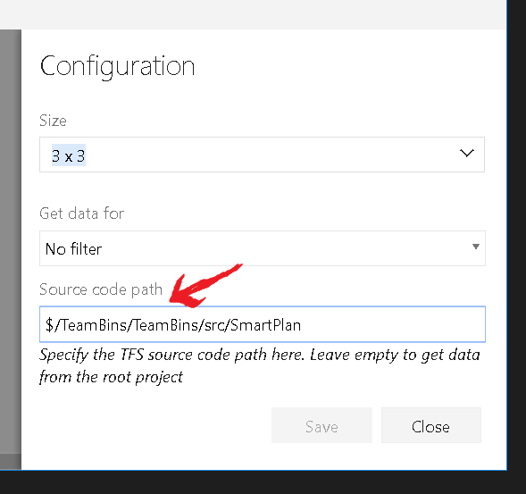

Recent Code Commits Widget helps you to quickly see the recent commits to  your team project in a dashboard widget.

Each commits will be displayed as a slide show as well.

You can configure the widget to get data for 

1. Current sprint
2. Last 7 days
3. Last 24 hours
4. Everything 

The configure screen also allows you get data from a specific project/source code path. This is really handy when you are interested in monitoring a specific sub direcory/project.

You can also adjust the size of the widget as needed.

### Questions ? 

If you have a question about the extension, hit me on twitter [@kshyju](https://www.twitter.com/kshyju) 
